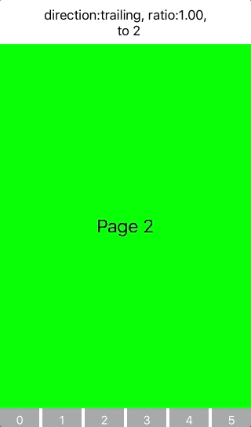

# JRPageViewControllerKit
[](https://travis-ci.org/psartzetakis/JRPageViewControllerKit)
[][podLink]
[](https://github.com/Carthage/Carthage)

[][mitLink]

JRPageViewControllerKit wraps all the boilerplate code that is required for the implementation of `UIPageViewController`.

## About

This library aims to wrap all the boilerplate code that is required for the implementation of the `UIPageViewController`. Within a few lines of code you have a `UIPageViewController` ready to run. In order to achieve that this library overrides the `UIPageViewControllerDataSource` and `UIPageViewControllerDelegate` with a custom implementation. It also implements the `UIScrollViewDelegate` of the scrollview that is within the `UIPageViewController`.



## Requirements

* iOS 8+
* Swift 3.0
* Xcode 8

## Installation

#### [CocoaPods](http://cocoapods.org)

````ruby
use_frameworks!

pod 'JRPageViewControllerKit'
````
#### [Carthage](https://github.com/Carthage/Carthage)

````bash
github "psartzetakis/JRPageViewControllerKit"
````
## Getting Started
````swift
import JRPageViewControllerKit
````

### Example

````swift

// 1. Create a factory that will return `UIViewController` for a specific index.
let factory: ((Int) -> ChildViewController?) = { [unowned self] index -> ChildViewController? in
    let viewController = self.storyboard!.instantiateViewController(withIdentifier: "ChildViewController") as! ChildViewController
    viewController.index = index
    return viewController
}

// 2. Instantiate a `PageViewControllerManager`.
let pageViewControllerManager = PageViewControllerManager(insertIn: containerView, inViewController: self, totalPages: 6, viewControllerForIndex: factory)

// 3. Get notified when user swiped to another `UIViewController`.
pageViewControllerManager.didScrollToIndex = { index in
    // The index that the user has just scrolled.
}

// 4. Get notified when another `UIViewController` is about to be appeared.
pageViewControllerManager.nextViewControllerAppears = { [unowned self] direction, ratio, destinationIndex in
    let ratio = String(format: "%.2f", ratio)
    let text = "direction:\(direction.rawValue), ratio:\(ratio),\n  to \(destinationIndex)"
}
````

## Licence

```JRPageViewControllerKit``` is being provided under [MIT Licence][MIT].


[MIT]:<https://opensource.org/licenses/MIT>

>Copyright © 2016-present Panagiotis Sartzetakis

[podLink]:https://cocoapods.org/pods/JRPageViewControllerKit
[mitLink]:http://opensource.org/licenses/MIT
